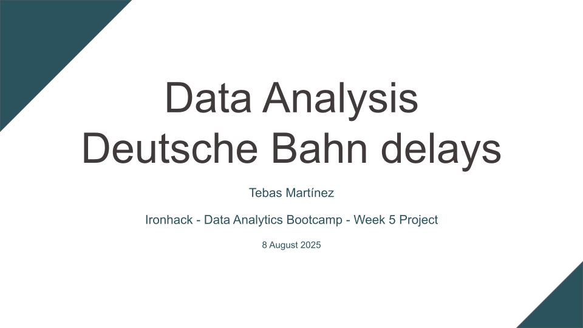

# Data Analysis - Deutsche Bahn delays

## Description
Analyse Deutsche Bahn delays data for 1 year (July 2024 to July 2025) including Regional and Intercity trains ICE, IC, RE, RB, and IRE.

## Data
Used [Deutsche Bahn Data-Fetching tool](https://github.com/piebro/deutsche-bahn-data) to fetch data from DB's [Timetables API](https://developers.deutschebahn.com/db-api-marketplace/apis/product/timetables), which is under a [CC BY 4.0 license](https://creativecommons.org/licenses/by/4.0/).

The file `data/combineddata.csv`, used in the Jupyter Notebooks throughout the analysis, is too big to upload to GitHub. It can be generated locally from a clone of this repo running `combinedata.py`:
````
python combinedata.py data/datalist.txt combineddata.csv
````

The file `data/clean_grouped_combineddata.csv`, used in Tableau, is also too big to upload to GitHub. Once `data/combineddata.csv` has been created with the previous command, it can be generated locally from a clone of this repo running `clean_filter_group_data.py`:
````
python clean_filter_group_data.py
````

## Questions / Hypothesis
- Are Deutsche Bahn trains late more than 33% of the time?
- Is there a difference in train delays between stations in former West/East Germany?
- Is any type of train (ICE, IC, RE, RB, or IRE) late more often than others?
- Are trains late more often in a specific season?

## Methodology
### Week plan:
- Monday: 
  - Look for data.
  - Formulate relevant questions.
- Tuesday:
  - Combine dataframes.
  - Filter data.
  - Clean data.
- Wednesday:
  - Univariate EDA.
  - Bivariate EDA.
- Thursday:
  - Tableau dashboard.
  - Presentation.

### Punctuality definition:
- For this analysis, I've used the same definition of punctuality that the Deutsche Bahn considers as "operational punctuality" in [their own reports](https://www.deutschebahn.com/de/konzern/konzernprofil/zahlen_fakten/puenktlichkeitswerte-6878476#). Trains are considered on time if they arrive with a delay of less than 6 minutes.

### Train types included:
- ICE: InterCityExpress
- IC: InterCity
- RE: Regional-Express
- RB: Regionalbahn
- IRE: Interregio-Express

### Locations:
- The analysis only considers station of departure.

### Grouping by former East/West Germany:
- For the purposes of this analysis, all stations in Berlin have been labelled as East.

## Repository content
- Data:
  - `data` directory, including 13 .parquet files each containing data for one month, and a .txt file listing them.
- Analysis:
  - `Univariate EDA.ipynb` in Jupyter Notebook.
  - `Bivariate EDA.ipynb` in Jupyter Notebook.
- Python helper files:
  - `functions.py` contains functions used throughout the analysis.
  - `combinedata.py` combines the initial 13 .parquet files into a single .csv.
  - `clean_filter_group_data.py` applies some of the functions in `functions.py` to the previously generated .csv, making it ready for Tableau.

## Conclusions

- Are Deutsche Bahn trains late more than 33% of the time?
  - No: 22,34% of the analysed trips were late.

- Is there a difference in train delays between stations in former West/East Germany?
  - Yes:
    - Former East Germany: 15,31% late trips.
    - Former West Germany: 24,60% late trips.

- Is any type of train (ICE, IC, RE, RB, or IRE) late more often than others?
  - Yes:
    - Intercity trains have been late more often than regional trains.

- Are trains late more often in a specific season?
  - All seasons are within ±3 percentage points of the overall 22,34% of late trips.


## Further questions
- Multivariate analysis: cross delays with station of departure and station of arrival. Are differences in delays by locations maintained when considering station of arrival too?
- Are there differences between Bundesländer?
- How do these medium-long distance services compare to local services such as S-Bahn?

## Resources
- [Tableau dashboard](https://public.tableau.com/views/DA-Deutsche-Bahn-delays/DA-DeutscheBahndelays)
[](https://public.tableau.com/views/DA-Deutsche-Bahn-delays/DA-DeutscheBahndelays)

- [Presentation](https://docs.google.com/presentation/d/1KAW7xkThyYQWdZLAZBlmom_rsz0XtU7AArOaDFuBh64/edit?usp=sharing)
[](https://docs.google.com/presentation/d/1KAW7xkThyYQWdZLAZBlmom_rsz0XtU7AArOaDFuBh64/edit?usp=sharing)